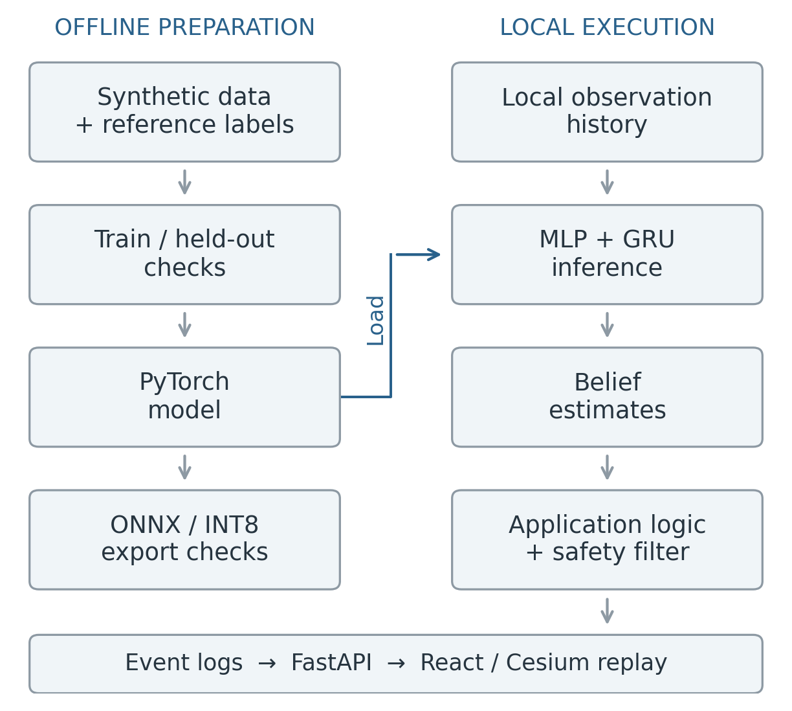
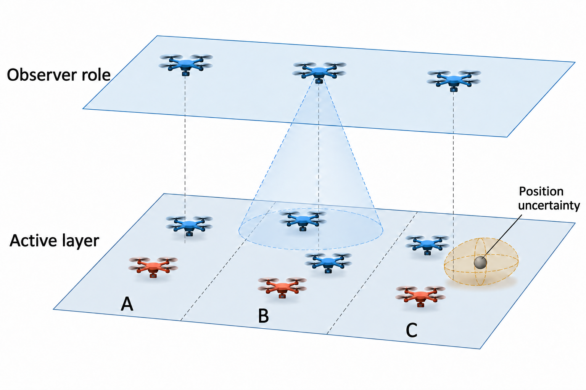
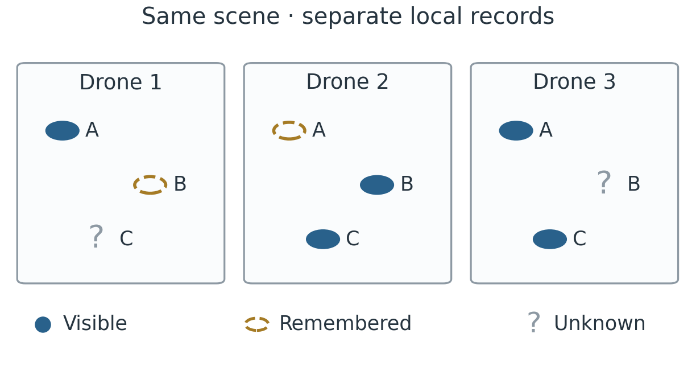

# HUSH: Coordination Without Communication for AirDnD

Team 37 — Joseph Poon, Lim Tze Kai, Lin Junyu, Alicia Tang

Abstract—HUSH (Handoff Under Signal Hostility) explores coordination when radio links disappear. Each drone interprets its own incomplete view, remembers earlier observations and observes activity around it. AirDnD is the simulation prototype used to demonstrate and evaluate this concept. It combines local estimates, explicit application rules and temporary Observer roles. We present the architecture, offline training and four evaluation scenarios, followed by initial software results and next steps.

Index Terms—HUSH, local observation, coordination without radio messages, swarm simulation.

## I. PROBLEM AND PRIOR WORK

Track 3, Layer 03 concerns onboard autonomy under ground-link denial. AirDnD assumes unavailable satellite navigation (GNSS), ground links and inter-drone radio. Different viewpoints and lost observations leave each drone with an incomplete picture.

Reynolds demonstrated collective motion from local perception [1]. Muro et al. modelled wolf-pack coordination emerging without explicit communication or hierarchy [2]. Stander observed role specialisation in lion group hunts [3]. These simulation and field studies motivate local observation and complementary roles. They provide a conceptual foundation for HUSH.

## II. THE HUSH CONCEPT

HUSH is the coordination concept; AirDnD is the simulation prototype used to demonstrate and evaluate it. Each drone keeps its own observation history and estimates what is happening. Shared rules are loaded beforehand. An ordinary drone may temporarily observe the scene from a different viewpoint. Coordination develops from local interpretation of visible activity, without radio instructions.

Intended users are government agencies developing defensive systems to intercept drones that pose a threat. The operating scenario assumes jamming makes GNSS, ground links and inter-drone radio unavailable. AirDnD’s simulator, training pipeline and replay support evaluation of HUSH in this environment.

## III. DEPLOYMENT AND SENSING

An Observer is an ordinary friendly drone watching both an active interceptor and the tracked object. Its viewpoint preserves awareness when the active drone has a restricted forward view. The design allows an eligible Observer to become an active interceptor as a backup following a failed attempt. Each drone evaluates its role locally under preloaded rules, without a central dispatcher or radio handoff message.

The specification initially holds 25% of the total friendly fleet available as reserve. Reserve describes availability; Observer describes a current sensing role. The upper layer illustrates airborne reserves watching the scene. The number acting as Observers changes with visibility and activity.

### A. Proposed onboard functions

The sensing concept includes a forward-looking camera, an accelerometer and gyroscope for motion, a barometer for altitude, battery monitoring, a computer and flight control. A near-infrared (NIR) beacon provides an identity cue. Table I groups the information these functions would supply.

### B. Information boundaries

Each drone labels and remembers the objects it observes. Drones exchange zero radio messages about object locations, assignments or intended actions. The proposed NIR beacon carries identity information only. The simulator sends logs to the browser for inspection through a separate display connection outside the simulated aircraft network.

## IV. ONE SCENE, DIFFERENT LOCAL VIEWS

A camera sees only the scene within its field of view. Turning can move an object out of sight while an Observer still sees it from another viewpoint (Fig. 3). The Observer’s record can preserve awareness of the event and its outcome. Its observations remain local; other drones receive no shared camera view.

### A. Local inputs and memory

TABLE I: SENSING AND CONTEXT CATEGORIES

| Category | Meaning |
|---|---|
| Scene | Objects and activity visible to this drone |
| Own state | Estimated motion, position and remaining energy |
| Evidence quality | Observation age, uncertainty and identity status |
| Preloaded context | Sectors, boundaries and shared rules |

The implemented model receives simulator-generated numerical observation histories. The proposed camera, inertial sensors and identity beacon form a future physical sensing pipeline. Table I groups sensing and context information; it is a conceptual overview. The numerical model uses a narrower representation of local observations and state.

A local belief summarises one drone’s evidence. A private coverage window is its temporary estimate that a previously observed task remains covered. Older evidence becomes less useful as the scene changes.

Figure 4 distinguishes visible, remembered and unknown information. The same object can occupy different states in different drones’ records. A remembered observation therefore needs an age, while an unknown state preserves the absence of evidence.

### B. Consistency and inspection

Tie-breaking applies a fixed rule when choices are nearly equal. Hysteresis limits repeated switching caused by small fluctuations in estimates. The specification includes a three-count switching rule; its current implementation status is summarised in Section VII.

The browser supports local perspectives, frame stepping and comparisons between drones. Local views hide evaluator truth by default; reviewers can enable a separate overlay. This makes differences in available information visible while replaying the same recorded event.

## V. LEARNING AND CHECKING ESTIMATES

Jev, developed by TypeSafe AI, provides the System One reference: structured judgments with probabilities [4]. AirDnD independently trains a compact model for HUSH. A multilayer perceptron (MLP) processes observations; a gated recurrent unit (GRU) summarises recent history. This numerical design supports local execution and inspection.

The flow is local history → model estimates → application rules. The model estimates leakage (an object passing the protected boundary), success of a simulated action, and friendly coverage (another drone completing the task). Each probability lies between 0 and 1. Position, timing and confidence estimates accompany these forecasts. Separate application rules consume the estimates.

### A. Offline training and runtime inputs

Offline training can use simulator reference information to construct answer labels, with OR-Tools supporting assignment labels [5]. The runtime model receives the drone’s numerical local history. Reference assignments and evaluator outcomes are excluded from that input. Figure 1 separates preparation from execution.

We train on 256 synthetic samples for 30 epochs, or passes through the training data. Another 64 samples are held out using a different random seed and separate recorded streams. Training loss falls from 0.787 to 0.441; held-out loss falls from 0.793 to 0.450. Lower loss means closer agreement with these synthetic reference answers.

Scenario inference uses PyTorch. The pipeline also checks ONNX/INT8 export on a fixed verification batch; the INT8 file is 20,232 bytes.

### B. Checking probability estimates

Calibration asks whether similar forecasts match observed frequencies. The Brier score evaluates forecast error against recorded outcomes [6]:

$$
\mathrm{BS}=\frac{1}{N}\sum_{k=1}^{N}(\hat p_k-y_k)^2.
$$

Here $N$ counts examples, $\hat{p}_k$ is the forecast and $y_k$ equals 1 if the event occurs and 0 otherwise. A lower score means less prediction error. This formula evaluates forecast quality; application rules determine decisions separately.

## VI. SCENARIOS AND INITIAL RESULTS

The four scenarios examine the same sequence: local observations, estimates, recorded actions and outcomes. Table II separates recorded evidence from planned evaluation.

TABLE II: FOUR SCENARIOS

| Scenario | Purpose | Evidence status |
|---|---|---|
| Big swarm | Software execution with 100 hostile objects and 125 friendly drones; scaling from 20 to 100 hostiles | Recorded benchmark |
| Intelligent swarm | Friendly coordination from separate local views; comparison with handwritten estimates | Replay and benchmark |
| Concentrated waves | Repeated arrivals concentrated in one area; comparison of initial reserve shares | Planned evaluation |
| Hit and miss | Inspect local views and an Observer role change in success and miss examples | Fixed replays; first outcome forced |

The proposed deployment sequence starts at a base, proceeds through departure to the assigned flight area, and includes return on low battery or an aborted operation (Table III). Observer is a temporary mission role; reserve describes availability. A coverage gap is reduced observation after departure; refill means occupying the vacant position.

TABLE III: PROPOSED FLIGHT STATES

| State | Meaning |
|---|---|
| Docked | At base for readiness checks or recharging |
| Departing | Launched and travelling to the assigned flight area |
| On station | Airborne in the assigned area; may hold an Observer role |
| Returning | Leaving the operation for base after low battery or abort |
| Landed | Back at base, entering the docked state |

### A. Recorded comparison

Each method uses the same 30 random seeds. Table IV reports means across those runs. Leakage is the percentage of hostile objects left unneutralised by the finite simulation.

TABLE IV: MEAN RESULTS OVER 30 RUNS

| Method | Leakage (%) | Duplicates / run |
|---|---|---|
| Naive static | 34.80 | 0.00 |
| Independent greedy | 53.93 | 36.10 |
| Handwritten beliefs | 25.13 | 25.23 |
| AirDnD | 25.13 | 25.23 |
| OR-Tools reference | 30.57 | 0.00 |

AirDnD records 25.13% leakage against 53.93% for independent greedy: a paired reduction of 28.8 percentage points (approximate 95% interval: 27.4–30.2), or 53.4% relative reduction. Against static allocation, the reduction is 9.67 points. Simple baselines initially use 94 aircraft while AirDnD considers all 125, so resource access differs. Handwritten estimates produce identical leakage in each paired run.

Duplicates count recorded additional commitments to the same object. An event can remain counted even when an earlier success prevents a later trajectory from executing. Pending Observer recovery attempts are excluded from this count.

On the Apple M3 host, the 30 AirDnD runs recorded zero friendly collisions and zero entity drops. The p95 scenario runtime normalised per interceptor was 19.04 ms, calculated as total scenario elapsed time divided by 125.

## VII. SCOPE AND NEXT STEPS

### A. Identity and supporting safety

The identity concept distinguishes confirmed friendly, continuously tracked friendly, unknown and hostile-evidence states. A missing identity signal leaves uncertainty; shape alone cannot identify a lookalike drone. ORCA supplies the supporting collision-avoidance layer [7]. Its research project acknowledges partial DARPA funding. HUSH addresses coordination through local information.

### B. Validation scope

Current evidence comes from simplified software scenes and synthetic observations. The three-count hysteresis helper exists, while scenario runs use immediate initialisation. Calibration covers one output over a narrow probability range. The fixed miss replay records a role change following a forced miss; it provides no validation of pre-miss recognition or immediate physical response. Concentrated waves, realistic sensing and identity signals, sustained patrol and recharging, continuous flight, debris and physical recovery reliability remain separate validation tasks.

### C. Value and continuation

AirDnD links local observations, estimates and recorded outcomes for review. Next software checks cover concentrated waves, probability calibration and sensing. The proposed roadmap progresses to a five-node hardware-in-the-loop (HIL) testbed, controlled maritime flight trials and possible Singapore Armed Forces (SAF) integration. These future stages require validation and partner agreement.

HUSH combines local observation, memory and temporary roles under radio silence. AirDnD makes this concept inspectable through training and replay.

## REFERENCES

[1] C. W. Reynolds, “Flocks, herds, and schools: A distributed behavioral model,” ACM SIGGRAPH Computer Graphics, vol. 21, no. 4, pp. 25–34, 1987. doi: 10.1145/37402.37406.

[2] C. Muro, R. Escobedo, L. Spector, and R. P. Coppinger, “Wolf-pack (Canis lupus) hunting strategies emerge from simple rules in computational simulations,” Behavioural Processes, vol. 88, no. 3, pp. 192–197, 2011. doi: 10.1016/j.beproc.2011.09.006.

[3] P. E. Stander, “Cooperative hunting in lions: The role of the individual,” Behavioral Ecology and Sociobiology, vol. 29, no. 6, pp. 445–454, 1992. doi: 10.1007/BF00170175.

[4] TypeSafe AI, “System One.” Accessed: Sept. 27, 2026. [Online]. Available: https://docs.typesafe.ai/concepts/system-one

[5] Google, “Solving an assignment problem,” OR-Tools. Accessed: Sept. 27, 2026. [Online]. Available: https://developers.google.com/optimization/assignment/assignment_example

[6] G. W. Brier, “Verification of forecasts expressed in terms of probability,” Monthly Weather Review, vol. 78, no. 1, pp. 1–3, 1950.

[7] J. van den Berg, S. J. Guy, M. Lin, and D. Manocha, “Reciprocal n-body collision avoidance,” in Robotics Research, vol. 70, Springer, 2011, pp. 3–19. Project: https://gamma-web.iacs.umd.edu/ORCA/.
